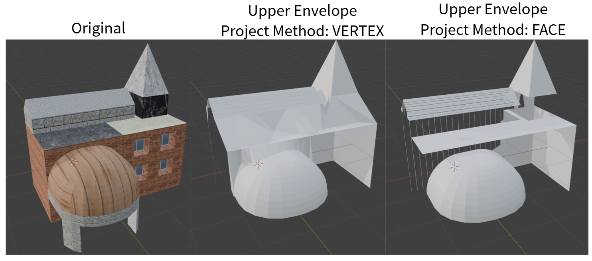

# upper_envelope_blender
在 Blender 中尋找 Upper Envelope



# 原理

將 active object 的所有面投影到 XY 平面上求 mesh arrangement（把投影在 XY 平面上的所有面，通通裁切並拼接成一組邊界清晰、互不重疊的 planar graph），然後將 mesh arrangement 的結果投影回 3D 空間。

# Install Dependency

Step 1. 使用管理員權限開啟 command line，並移動到 blender 使用的 python.exe 所在目錄

Step 2.

```
python -m pip install git+https://github.com/jeang-bo-yuan/mesh2D_arrangement_python.git
```

# 參數

Name | Description
---|---
Project Method| 投影回 3D 時以 VERTEX 為單位進行投影或以 FACE 為單位進行投影
Auto Adjust Buffer Size| 在 Project Method 為 VERTEX 時 Buffer Size 設成 1e-15，在 Project Method 為 FACE 時設成 1e-10
Buffer Size|因為數值問題，在計算 mesh arrangement 時交點可能會偏離原直線一點點，導致 arrangement 的結果可能比原本輸入的三角面還要向外擴。<br/>所以在把頂點投影回去時，把原本的每個平面在 XY 平面上都向外擴 buffer_size 的大小再做覆蓋（cover）檢測。<br/><br/>buffer_size 調大會把更多 arrangement 的面投影到同個平面上，結果「可能」會看起來更 low poly。<br/>但是在遇到幾乎垂直的面時，反而會把旁邊的頂點拉到極端高的地方。
Do Cleanup|是否對 Upper Envelope 的結果清理過多的頂點。 **!!!WARNING!!!: 清理的結果可能會影響拓樸。**
